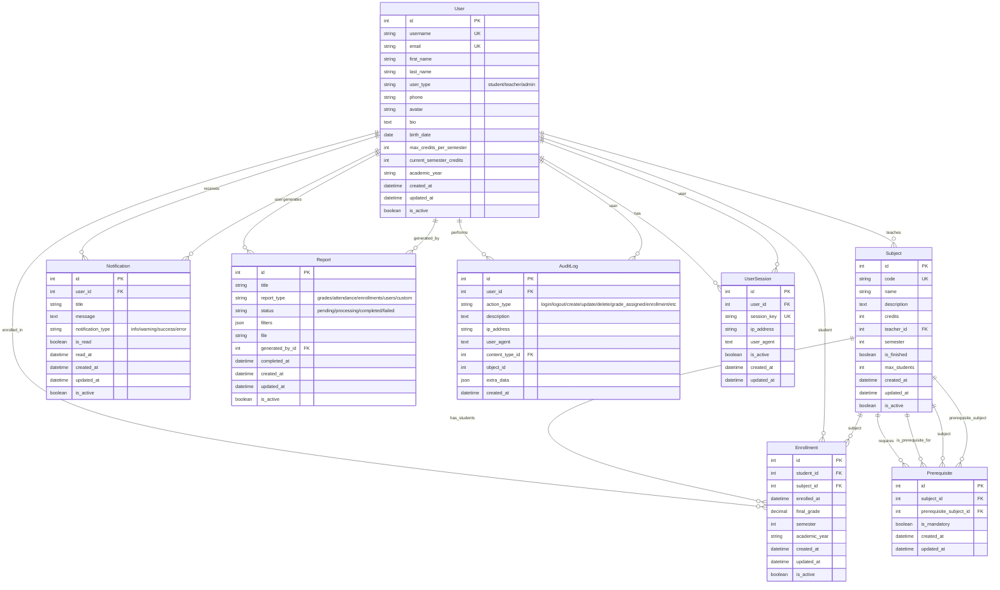

# 📊 ESQUEMA DE BASE DE DATOS (ERD) - Backend Alternova

## 🗄️ Diagrama de Entidad-Relación

## 📋 Descripción de Entidades

### 👤 **User (Usuario)**

- **Propósito**: Gestión de usuarios del sistema (estudiantes, profesores, administradores)
- **Campos Clave**: `user_type`, `academic_year`, `max_credits_per_semester`
- **Relaciones**: Central - conecta con todas las demás entidades

### 📚 **Subject (Materia)**

- **Propósito**: Gestión de materias/asignaturas académicas
- **Campos Clave**: `code` (único), `credits`, `teacher_id`, `max_students`
- **Relaciones**: Conecta con User (profesor), Enrollment (estudiantes), Prerequisite

### 🔗 **Prerequisite (Prerrequisito)**

- **Propósito**: Define prerrequisitos entre materias
- **Campos Clave**: `subject_id`, `prerequisite_subject_id`, `is_mandatory`
- **Relaciones**: Auto-referencial con Subject

### 📝 **Enrollment (Inscripción)**

- **Propósito**: Registra inscripciones de estudiantes en materias
- **Campos Clave**: `student_id`, `subject_id`, `final_grade`, `academic_year`
- **Restricciones**: Único por estudiante-materia-año académico

### 🔔 **Notification (Notificación)**

- **Propósito**: Sistema de notificaciones para usuarios
- **Campos Clave**: `user_id`, `notification_type`, `is_read`
- **Relaciones**: Conecta con User

### 📊 **Report (Reporte)**

- **Propósito**: Generación de reportes del sistema
- **Campos Clave**: `report_type`, `status`, `filters`, `generated_by_id`
- **Relaciones**: Conecta con User (generador)

### 🔍 **AuditLog (Log de Auditoría)**

- **Propósito**: Registro de todas las acciones importantes del sistema
- **Campos Clave**: `action_type`, `ip_address`, `user_agent`, `extra_data`
- **Relaciones**: Conecta con User, ContentType (genérico)

### 🔐 **UserSession (Sesión de Usuario)**

- **Propósito**: Gestión de sesiones activas de usuarios
- **Campos Clave**: `user_id`, `session_key`, `is_active`
- **Relaciones**: Conecta con User

## 🎯 Características del Diseño

### ✅ **Ventajas del Diseño**

1. **Normalización**: Evita redundancia de datos
2. **Integridad**: Claves foráneas garantizan consistencia
3. **Auditoría**: Registro completo de acciones
4. **Flexibilidad**: Campos JSON para datos dinámicos
5. **Escalabilidad**: Índices optimizados para consultas

### 🔧 **Patrones Implementados**

1. **Soft Delete**: Eliminación lógica con `is_active` y `deleted_at`
2. **Auditoría**: Registro de creación/modificación con `created_by`/`updated_by`
3. **Timestamps**: `created_at` y `updated_at` automáticos
4. **Generic Foreign Keys**: Para auditoría de cualquier modelo
5. **Unique Constraints**: Para evitar duplicados críticos

### 📈 **Optimizaciones**

1. **Índices**: En campos de consulta frecuente
2. **Campos Calculados**: Propiedades para lógica de negocio
3. **Validaciones**: A nivel de modelo y base de datos
4. **Managers Personalizados**: Para consultas optimizadas
