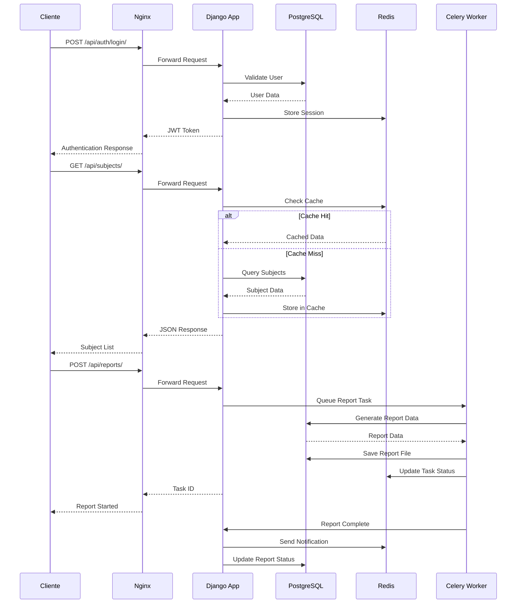

# 🔄 FLUJO DE DATOS - Backend Alternova

```mermaid
sequenceDiagram
    participant C as Cliente
    participant N as Nginx
    participant D as Django App
    participant DB as PostgreSQL
    participant R as Redis
    participant CW as Celery Worker
    
    %% Autenticación
    C->>N: POST /api/auth/login/
    N->>D: Forward Request
    D->>DB: Validate User
    DB-->>D: User Data
    D->>R: Store Session
    D-->>N: JWT Token
    N-->>C: Authentication Response
    
    %% Operación CRUD
    C->>N: GET /api/subjects/
    N->>D: Forward Request
    D->>R: Check Cache
    alt Cache Hit
        R-->>D: Cached Data
    else Cache Miss
        D->>DB: Query Subjects
        DB-->>D: Subject Data
        D->>R: Store in Cache
    end
    D-->>N: JSON Response
    N-->>C: Subject List
    
    %% Generación de Reporte
    C->>N: POST /api/reports/
    N->>D: Forward Request
    D->>CW: Queue Report Task
    CW->>DB: Generate Report Data
    DB-->>CW: Report Data
    CW->>DB: Save Report File
    CW->>R: Update Task Status
    D-->>N: Task ID
    N-->>C: Report Started
    
    %% Notificación
    CW->>D: Report Complete
    D->>R: Send Notification
    D->>DB: Update Report Status
```
