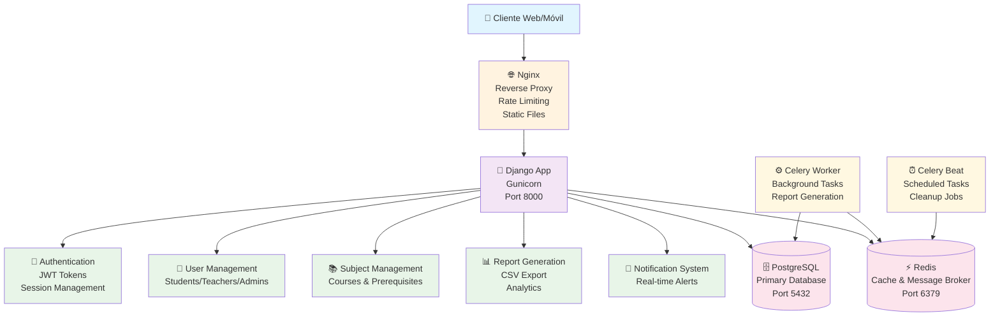
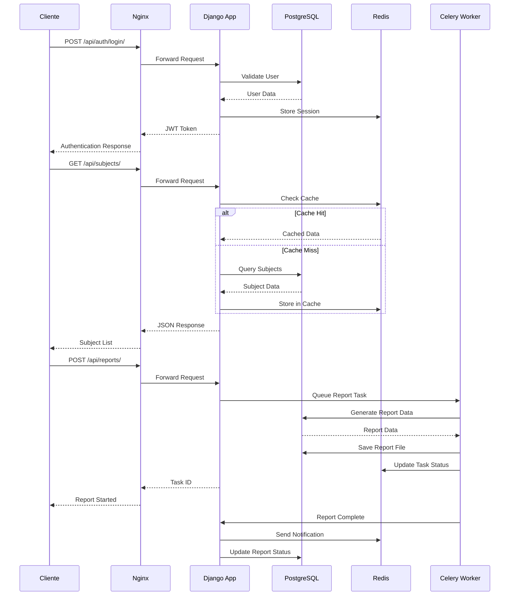
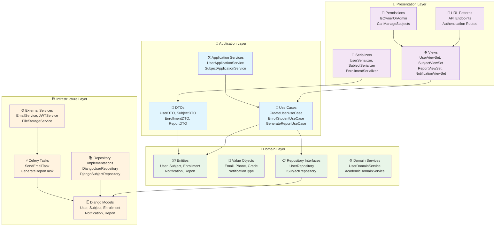
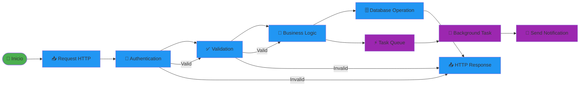
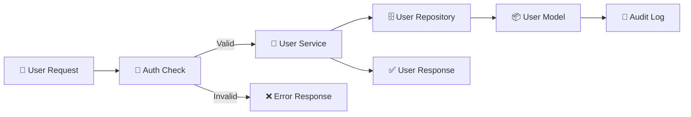
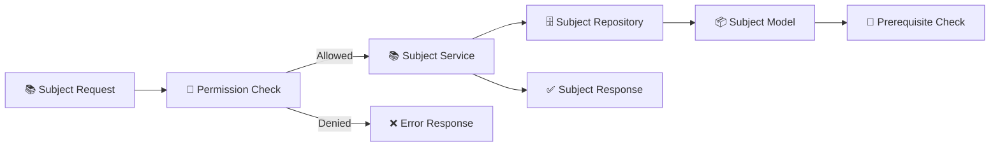
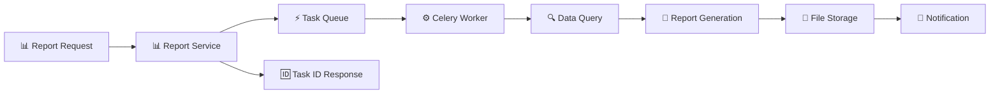

# 🔄 DIAGRAMA DE FLUJO DEL PROYECTO - Backend Alternova

## 🏗️ Arquitectura General del Sistema

## 🔄 Flujo de Datos Principal

## 🏛️ Arquitectura Clean Architecture

## 🔄 Flujo de Procesamiento de Tareas

## 📊 Flujo de Datos por Módulo

### 👥 **Módulo de Usuarios**

### 📚 **Módulo de Materias**

### 📊 **Módulo de Reportes**

## 🎯 Características del Flujo

### ✅ **Ventajas del Diseño**

1. **Separación de Responsabilidades**: Cada capa tiene un propósito específico
2. **Escalabilidad**: Celery permite procesamiento asíncrono
3. **Caching**: Redis mejora el rendimiento
4. **Auditoría**: Registro completo de todas las operaciones
5. **Seguridad**: Autenticación JWT y permisos granulares

### 🔧 **Patrones Implementados**

1. **Clean Architecture**: Separación clara de capas
2. **Repository Pattern**: Abstracción del acceso a datos
3. **CQRS**: Separación de comandos y consultas
4. **Event Sourcing**: Auditoría de cambios
5. **Microservices**: Servicios independientes

### 📈 **Optimizaciones**

1. **Connection Pooling**: Reutilización de conexiones DB
2. **Query Optimization**: Consultas eficientes
3. **Background Processing**: Tareas pesadas en segundo plano
4. **Caching Strategy**: Cache inteligente con Redis
5. **Rate Limiting**: Protección contra abuso
